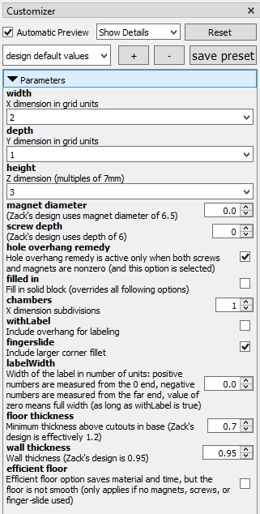
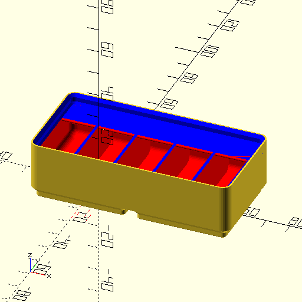
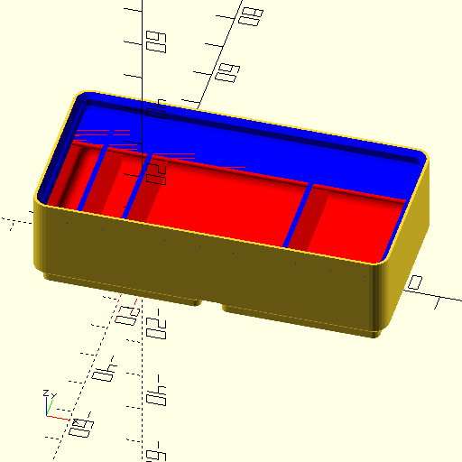
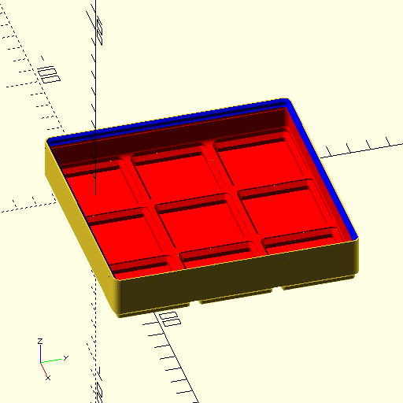
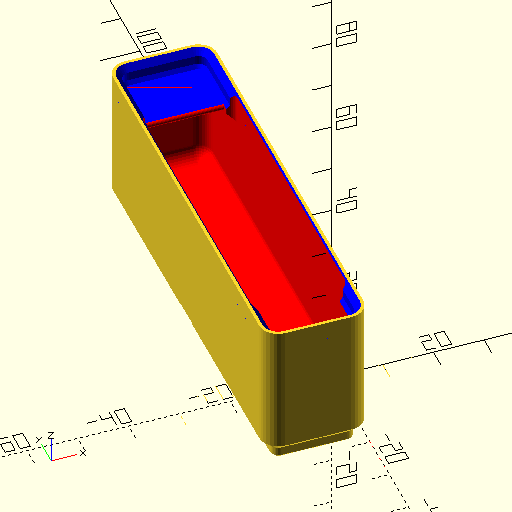
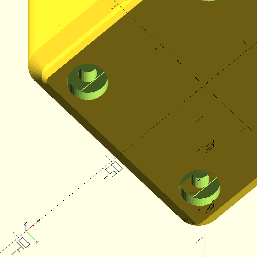
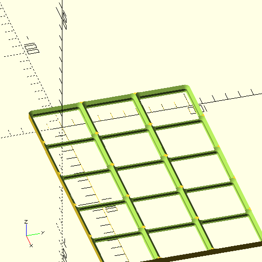
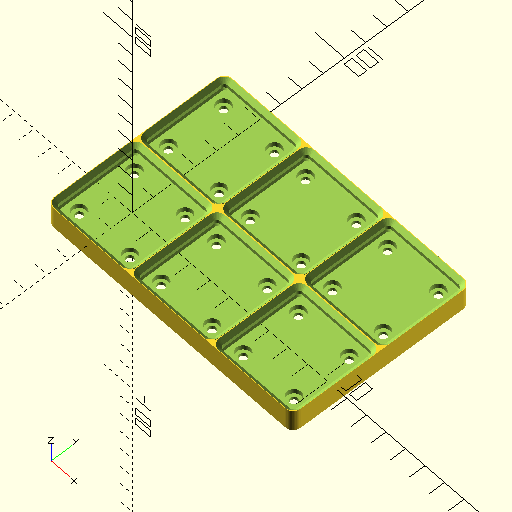
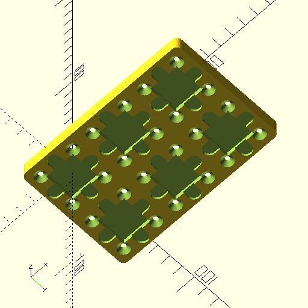
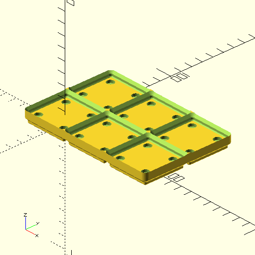

# Gridfinity OpenSCAD Model
This is a recreation of Zack Freedman's gridfinity system in OpenSCAD, 
intended for both experienced OpenSCAD users to customize with added features, 
and also less-experienced OpenSCAD users to customize via options offered in the customizer.

The fit-related dimensions are intended to match Zack's original design exactly.

Options for bins:
* Screw holes are optional, or alternative lengths can be specified
* Magnet pockets are optional, or alternative diameters can be specified
* User-selectable wall thickness and floor thickness
* Generate a filled-in block as a starting point for generating other models (similar in spirit to [this](https://www.printables.com/model/210548-filled-in-gridfinity-boxes-for-customization))
* Any number of subdivisions along X axis (only X subdivisions are implemented)
* Irregular subdivisions along X axis (only X subdivisions are implemented)
* Finger-slide for removing small parts, available as an option
* Label feature available as an option
* Label feature can cover entire X length or only part
* Label feature can be left-justified, right-justified, or centered
* Magnet/screw hole can have printable overhangs as an option (if screw holes and magnet pockets are both used) (similar in spirit to [this](https://www.printables.com/model/269834-gridfinity-template-modified-for-mid-air-holes))
* Option for material-efficient floor that is not flat but saves material/time (similar in spirit to [this](https://www.printables.com/model/265271-gridfinity-lite-economical-plain-storage-bins))
* Fractional-width bins (0.5 units) supported (similar in spirit to [this](https://www.printables.com/model/241907-gridfinity-half-boxes-up-to-3-grids-long-and-6u-hi))

Some other models are also included and are also parametric.  Not all of these will be interesting to most people.  Some of them are cosntructions for my own personal use.
* Gridfinity base options
  * Base (just frame)
  * Weighted base includes space for weights and/or screws or magnets
  * Lid/base combination can stack on top of bins and provides base for stacking on top (e.g. for stacking a 1x1 on top of a 3x3)
* Glue stick holder
* Socket holder
* Gridfinity base for Flsun Q5
* Silverware drawer

